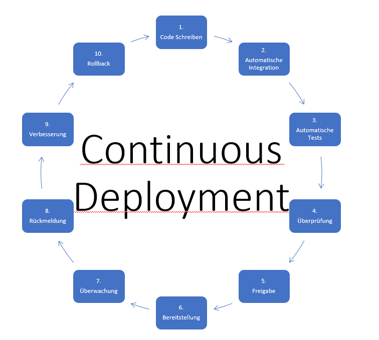
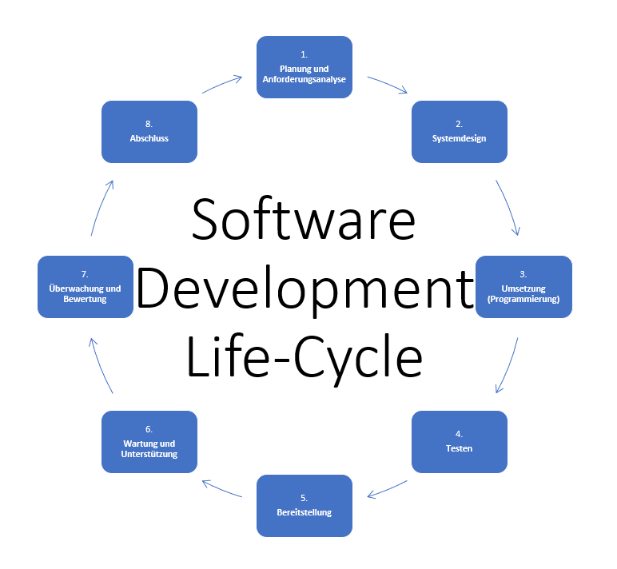

# Continuous Deployment: Die Zukunft der Softwarebereitstellung

---

# Inhaltsverzeichnis
- Definition - Was ist Continous Deployment?
- Aufbau und Funktionsweise einer Continuous Deployment-Pipeline
- Unterscheide zwischen Continuous Integration und Continuous Deployment
- Bedeutung der Automatisierung in Continuous Deployment
- SWOT-Analyse von Continuous Deployment
- Standard Software Development Life-Cycle vs. Continuous Deployment
- Fazit

---

# Was ist Continuous Deployment?
Continuous Deployment ist ein Teil der Continuous Integration, die bereits seit vielen Jahren in der Software-Entwicklung eingesetzt wird.

## Definition von Continuous Deployment
Continuous Deployment (CD) ist eine Praxis in der Softwareentwicklung, bei der Softwareänderungen automatisch und kontinuierlich von Entwicklungs- und Testumgebungen in die Produktionsumgebung übertragen und bereitgestellt werden. Dies ermöglicht es, Software schnell und zuverlässig in die Hände der Benutzer zu bringen, ohne manuelle Schritte und Verzögerungen.

---

# Standard Software Development Life-Cycle vs. Continuous Deployment

---

# Aufbau einer Continuous Deployment-Pipeline

1. **Quellcode-Repository**: Die Pipeline startet normalerweise mit einem Quellcode-Repository, in dem der Code des Projekts verwaltet wird, z.B. Git.

2. **Build-Phase**: In dieser Phase wird der Quellcode automatisch kompiliert und in ausführbare Artefakte umgewandelt, oft mithilfe von Build-Tools wie Gradle oder Maven.

3. **Automatisierte Tests**: Die erstellten Artefakte durchlaufen verschiedene Arten von automatisierten Tests, einschließlich Unit-Tests, Integrationstests, Funktionstests und Performance-Tests.

4. **Staging-Umgebung**: Nach erfolgreichen Tests wird die Software in einer Staging- oder Testumgebung bereitgestellt, die der Produktionsumgebung ähnelt.

5. **Manuelle Überprüfung (optional)**: In einigen Fällen erfolgt eine manuelle Überprüfung durch QA-Teams oder Stakeholder, bevor die Software in die Produktion übergeht.

6. **Automatische Bereitstellung**: Nach erfolgreicher Überprüfung erfolgt die automatische Bereitstellung in die Produktionsumgebung, oft schrittweise, um Risiken zu minimieren.

7. **Überwachung und Benachrichtigung**: Die Produktionsumgebung wird kontinuierlich überwacht, und bei Problemen oder Fehlern werden Benachrichtigungen ausgelöst.

8. **Rückmeldung und Verbesserung**: Benutzerfeedback und Überwachungsdaten fließen zurück in den Entwicklungsprozess, um Fehler zu beheben und neue Funktionen zu implementieren.

---

# Funktionsweise einer Continuous Deployment-Pipeline

- Die Pipeline wird automatisch ausgelöst, wenn Änderungen im Quellcode-Repository vorgenommen werden, z.B. durch Push-Events im Versionskontrollsystem.

- Die Build-Phase erstellt Artefakte aus dem Quellcode, um die Anwendung automatisiert zu erstellen.

- Die automatisierten Tests gewährleisten die Qualität der Software und überprüfen, ob sie den Anforderungen entspricht.

- Die Bereitstellung in der Staging-Umgebung ermöglicht es, Änderungen unter realistischen Bedingungen zu testen.

- Die automatische Bereitstellung in die Produktionsumgebung erfolgt nur bei erfolgreichen Tests und Freigabe.

- Die Überwachung sorgt für Stabilität und Leistung in der Produktionsumgebung.

- Bei Problemen stehen Rollback-Mechanismen zur Verfügung, um zur vorherigen stabilen Version zurückzukehren.

Die Continuous Deployment-Pipeline ermöglicht eine sichere und effiziente Bereitstellung von Softwareänderungen und trägt dazu bei, dass Entwicklerteams agiler werden, sodass Benutzer schneller von neuen Funktionen profitieren können.

---

# Unterschiede zwischen Continuous Integration und Continuous Deployment
**Continuous Integration (CI):**
- Integration von Codeänderungen in den Hauptentwicklungszweig.
- Hauptziel: Frühes Erkennen von Konflikten und Fehlern.
- Automatisierung von Builds und Tests.
- Bereitstellung in eine Entwicklungs- oder Testumgebung.
- Keine automatische Bereitstellung in die Produktionsumgebung.

**Continuous Deployment (CD):**
- Automatische Bereitstellung von Codeänderungen in die Produktionsumgebung.
- Hauptziel: Schnelle und zuverlässige Bereitstellung von Software.
- Automatisierung von Builds, Tests und Bereitstellungsschritten.
- Kontinuierliche Bereitstellung in die Produktionsumgebung.
- Erfordert umfassende Tests und Überwachung.

---

# Bedeutung der Automatisierung in Continuous Deployment

Die Automatisierung spielt eine entscheidende Rolle im Continuous Deployment-Prozess und bietet viele Vorteile für die Softwareentwicklung. Hier ist, warum die Automatisierung so wichtig ist:

1. **Effizienz**: Automatisierung beschleunigt den Bereitstellungsprozess erheblich. Aufgaben wie Build-Erstellung, Tests und Bereitstellung, die manuell Stunden oder Tage dauern könnten, werden in Minuten oder Sekunden erledigt.

2. **Wiederholbarkeit**: Automatisierte Prozesse sind konsistent und wiederholbar. Dies bedeutet, dass jede Softwareänderung denselben Satz von Schritten durchläuft, was die Wahrscheinlichkeit menschlicher Fehler minimiert.

3. **Qualitätssicherung**: Durch die Automatisierung von Tests können Entwickler sicherstellen, dass ihre Änderungen qualitativ hochwertig sind und den Anforderungen entsprechen. Automatisierte Tests führen zu einer besseren Codequalität.

4. **Skalierbarkeit**: Automatisierung ermöglicht es, den Bereitstellungsprozess auf einfache Weise zu skalieren, um mit einem wachsenden Codeumfang und einer wachsenden Benutzerbasis umzugehen.

5. **Schnelle Fehlererkennung**: Automatisierte Überwachung und Tests können Fehler in der Produktionsumgebung schnell erkennen und Benachrichtigungen auslösen, damit sie rasch behoben werden können.

6. **Zeit- und Ressourceneinsparungen**: Durch die Automatisierung von wiederkehrenden Aufgaben können Entwickler mehr Zeit für die eigentliche Entwicklung von Funktionen aufwenden, anstatt Zeit mit manuellen Schritten zu verbringen.

7. **Konsistenz**: Die Automatisierung stellt sicher, dass alle Umgebungen (Entwicklung, Test, Produktion) konsistent sind, was die Wahrscheinlichkeit von Umgebungsbedingten Fehlern reduziert.

8. **Beschleunigung der Markteinführung**: Durch die automatisierte Bereitstellung können neue Funktionen schneller auf den Markt gebracht werden, was einen Wettbewerbsvorteil verschafft.

Insgesamt ermöglicht die Automatisierung in Continuous Deployment eine schnellere und zuverlässigere Bereitstellung von Softwareänderungen, verbessert die Qualität der Software und ermöglicht es Entwicklungsteams, sich auf kritischere Aufgaben zu konzentrieren. Sie ist daher ein wesentlicher Bestandteil des CD-Prozesses.

---

# SWOT-Analyse von Continuous Deployment (CD)

## Stärken (Strengths):

- Schnellere Markteinführung von Software.
- Kontinuierliche Verbesserung der Softwarequalität.
- Effizienzsteigerung durch Automatisierung.
- Transparenz und Nachverfolgbarkeit im Bereitstellungsprozess.
- Höhere Teammotivation und Zusammenarbeit.

## Schwächen (Weaknesses):

- Komplexität der Implementierung und Infrastruktur.
- Hohe Anforderungen an Tests und Qualitätssicherung.
- Risiko von Fehlern in der Produktion.
- Erfordert kulturelle Veränderungen und Vertrauen.
- Nicht für alle Projekte oder Branchen geeignet.

---

## Chancen (Opportunities):

- Schnellere Anpassung an sich ändernde Kundenanforderungen.
- Wettbewerbsvorteil durch raschere Markteinführung.
- Bessere Reaktion auf Benutzerfeedback und Anforderungen.
- Potenzielle Kostenersparnisse durch Automatisierung.
- Erfüllung von Sicherheits- und Compliance-Anforderungen.

## Risiken (Threats):

- Unzureichende Tests und Überwachung können zu Problemen in der Produktion führen.
- Sicherheits- und Datenschutzbedenken bei unzureichender Absicherung.
- Kulturelle Widerstände und Schwierigkeiten bei der Einführung.
- Herausforderungen bei der Einhaltung strenger regulatorischer Anforderungen.
- Unvorhergesehene Abhängigkeiten und Risiken in der Software und Infrastruktur.

---

# Schlussfolgerung

Continuous Development (CD) ist ein agiler Ansatz zur Softwareentwicklung, der es Unternehmen ermöglicht, Software kontinuierlich zu verbessern und schneller auf sich ändernde Anforderungen zu reagieren. Dieser Prozess bietet viele Vorteile, darunter die schnellere Markteinführung von Software, kontinuierliche Qualitätsverbesserung und eine erhöhte Benutzerzufriedenheit.

Die Implementierung von CD erfordert eine sorgfältige Planung, eine gut durchdachte Infrastruktur und die Schaffung einer Kultur der Zusammenarbeit mit gegenseitiger Verantwortung im Entwicklerteam. Während CD viele Chancen bietet, müssen auch Herausforderungen und Risiken berücksichtigt werden, darunter die Notwendigkeit umfassender Tests und die Sicherstellung von Sicherheit und Datenschutz.

Insgesamt kann Continuous Development dazu beitragen, dass Softwareunternehmen wettbewerbsfähiger und agiler werden. Durch die kontinuierliche Bereitstellung von Softwareänderungen können sie die Bedürfnisse ihrer Benutzer besser erfüllen und innovative Lösungen schneller auf den Markt bringen.

---

# Quellen
- https://www.synopsys.com/glossary/what-is-continuous-development.html#:~:text=Definition,it%20is%20completed%20and%20tested.
- https://www.servicenow.com/products/it-operations-management/what-is-continuous-development.html
- https://mindsquare.de/knowhow/continuous-deployment/
- https://www.ibm.com/de-de/topics/continuous-deployment#:~:text=den%20n%C3%A4chsten%20Schritt-,- Was%20ist%20Continuous%20Deployment%3F,in%20die%20Produktionsumgebung%20freigegeben%20werden.
- https://www.jetbrains.com/de-de/teamcity/ci-cd-guide/continuous-deployment/
- https://www.dev-insider.de/was-ist-continuous-deployment-a-652804/
- https://www.ionos.de/digitalguide/websites/web-entwicklung/continuous-integration/
- https://www.synopsys.com/glossary/what-is-sdlc.html
- https://medium.com/@jilvanpinheiro/software-development-life-cycle-sdlc-phases-40d46afbe384
- https://www.dev-insider.de/aufbau-einer-continuous-delivery-pipeline-in-kubernetes-a-10d07f52744642f22771b2973b5d7051/
- Wilken, T. (2016). Bedeutung von automatisierten Akzeptanztests innerhalb der Deployment Pipeline (Doctoral dissertation, Hochschule für angewandte Wissenschaften Hamburg).
- Alt, R., Auth, G., Kögler, C., Alt, R., Auth, G., & Kögler, C. (2017). Innovationsorientiertes IT-Management mit DevOps (pp. 21-32). Springer Fachmedien Wiesbaden.

