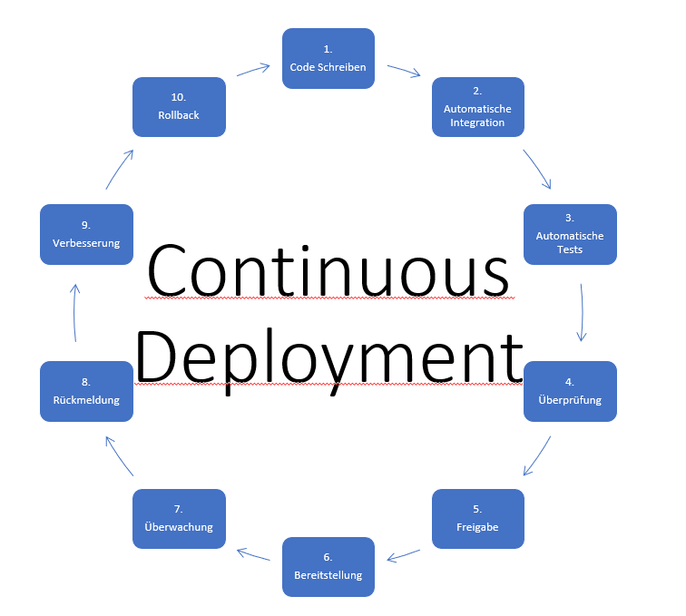

# Continuous Deployment: Die Zukunft der Softwarebereitstellung

---

# Inhaltsverzeichnis
- Definition - Was ist Continous Deployment?
- Unterscheide zwischen Continuous Integration und Continuous Deployment
- SWOT-Analyse von Continuous Deployment
- Standard Software Development Life-Cycle vs. Continuous Deployment
- Fazit
---

# Was ist Continuous Deployment?
Continuous Deployment ist ein Teil der Continuous Integration, die bereits seit vielen Jahren in der Software-Entwicklung eingesetzt wird.

## Definition von Continuous Deployment
Continuous Deployment (CD) ist eine Praxis in der Softwareentwicklung, bei der Softwareänderungen automatisch und kontinuierlich von Entwicklungs- und Testumgebungen in die Produktionsumgebung übertragen und bereitgestellt werden. Dies ermöglicht es, Software schnell und zuverlässig in die Hände der Benutzer zu bringen, ohne manuelle Schritte und Verzögerungen.

---

# Standard Software Development Life-Cycle vs. Continuous Deployment

---

# Unterschiede zwischen Continuous Integration und Continuous Deployment
**Continuous Integration (CI):**
- Integration von Codeänderungen in den Hauptentwicklungszweig.
- Hauptziel: Frühes Erkennen von Konflikten und Fehlern.
- Automatisierung von Builds und Tests.
- Bereitstellung in eine Entwicklungs- oder Testumgebung.
- Keine automatische Bereitstellung in die Produktionsumgebung.

**Continuous Deployment (CD):**
- Automatische Bereitstellung von Codeänderungen in die Produktionsumgebung.
- Hauptziel: Schnelle und zuverlässige Bereitstellung von Software.
- Automatisierung von Builds, Tests und Bereitstellungsschritten.
- Kontinuierliche Bereitstellung in die Produktionsumgebung.
- Erfordert umfassende Tests und Überwachung.

---

# SWOT-Analyse von Continuous Deployment (CD)

## Stärken (Strengths):

- Schnellere Markteinführung von Software.
- Kontinuierliche Verbesserung der Softwarequalität.
- Effizienzsteigerung durch Automatisierung.
- Transparenz und Nachverfolgbarkeit im Bereitstellungsprozess.
- Höhere Teammotivation und Zusammenarbeit.

## Schwächen (Weaknesses):

- Komplexität der Implementierung und Infrastruktur.
- Hohe Anforderungen an Tests und Qualitätssicherung.
- Risiko von Fehlern in der Produktion.
- Erfordert kulturelle Veränderungen und Vertrauen.
- Nicht für alle Projekte oder Branchen geeignet.

---

## Chancen (Opportunities):

- Schnellere Anpassung an sich ändernde Kundenanforderungen.
- Wettbewerbsvorteil durch raschere Markteinführung.
- Bessere Reaktion auf Benutzerfeedback und Anforderungen.
- Potenzielle Kostenersparnisse durch Automatisierung.
- Erfüllung von Sicherheits- und Compliance-Anforderungen.

## Risiken (Threats):

- Unzureichende Tests und Überwachung können zu Problemen in der Produktion führen.
- Sicherheits- und Datenschutzbedenken bei unzureichender Absicherung.
- Kulturelle Widerstände und Schwierigkeiten bei der Einführung.
- Herausforderungen bei der Einhaltung strenger regulatorischer Anforderungen.
- Unvorhergesehene Abhängigkeiten und Risiken in der Software und Infrastruktur.

---

## Schlussfolgerung

Continuous Development (CD) ist ein agiler Ansatz zur Softwareentwicklung, der es Unternehmen ermöglicht, Software kontinuierlich zu verbessern und schneller auf sich ändernde Anforderungen zu reagieren. Dieser Prozess bietet viele Vorteile, darunter die schnellere Markteinführung von Software, kontinuierliche Qualitätsverbesserung und eine erhöhte Benutzerzufriedenheit.

Die Implementierung von CD erfordert eine sorgfältige Planung, eine gut durchdachte Infrastruktur und die Schaffung einer Kultur der Zusammenarbeit mit gegenseitiger Verantwortung im Entwicklerteam. Während CD viele Chancen bietet, müssen auch Herausforderungen und Risiken berücksichtigt werden, darunter die Notwendigkeit umfassender Tests und die Sicherstellung von Sicherheit und Datenschutz.

Insgesamt kann Continuous Development dazu beitragen, dass Softwareunternehmen wettbewerbsfähiger und agiler werden. Durch die kontinuierliche Bereitstellung von Softwareänderungen können sie die Bedürfnisse ihrer Benutzer besser erfüllen und innovative Lösungen schneller auf den Markt bringen.

